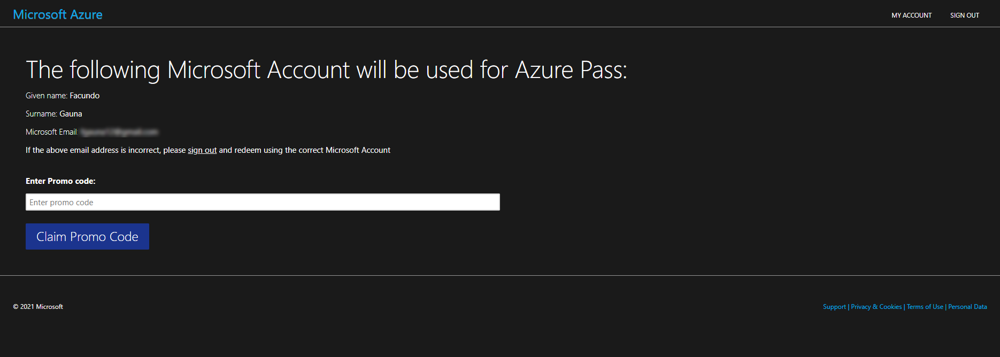
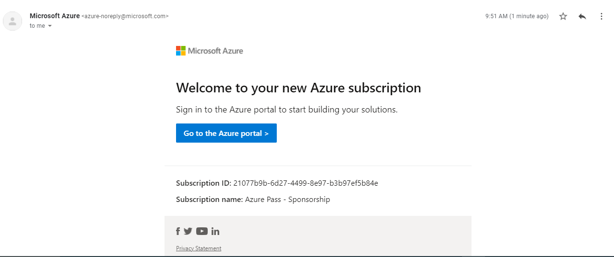

---
# Page settings
layout: default
keywords:
comments: false

# Hero section
title: Pre-Requisites
description: New to Azure? Don't worry. We will give you a temporary account.

# Micro navigation
micro_nav: true

# Page navigation
page_nav:
    next: 
        content: Lab - Intro to Azure Kubernetes Service (AKS)
        url: '/lab-aks'
---

## Welcome to Azure Pass

Azure Pass is a system that allows attendes of events like this one to get a temporary Azure subscription.
We will walk you through obtaining your personal and temporary subscription so that you can try out some of the material of this workshop.

### 0. Get the code

Someone from our team will reach out to you and give you a code. This code will be used to redeem your Azure subscription.

This Azure subscription will **expire by the end of this week**.
This subscription is pre-loaded with $50. No credit card required.

### 1. Redeem

Using a **private browser** and a personal **Microsoft account**, go to [https://www.microsoftazurepass.com/](https://www.microsoftazurepass.com/).




### 2. Enjoy!

Once your subscription is ready, you should be directed to the Azure portal at [https://portal.azure.com](https://portal.azure.com).

The name of your new subscription will be **Azure Pass - Sponsorship**.



### 3. (Optional) Using the Azure CLI

If you don't have the Azure CLI installed, follow the steps at [https://docs.microsoft.com/en-us/cli/azure/install-azure-cli](https://docs.microsoft.com/en-us/cli/azure/install-azure-cli).


Then you can authenticate with the CLI to your new Azure subscription.

```shell

$ az login --use-device-code
# It will give you a URL and a code. Paste the URL in your incognito browser window. 
# Once logged in, you will see a JSON object with subscription information. 
# Grab the ID of the 'Azure Pass - Sponsorship' subscription.

$ az account set -s "[ Your Subscription ID ]"

```